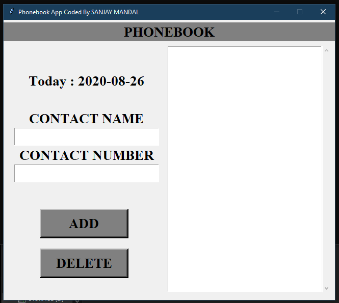
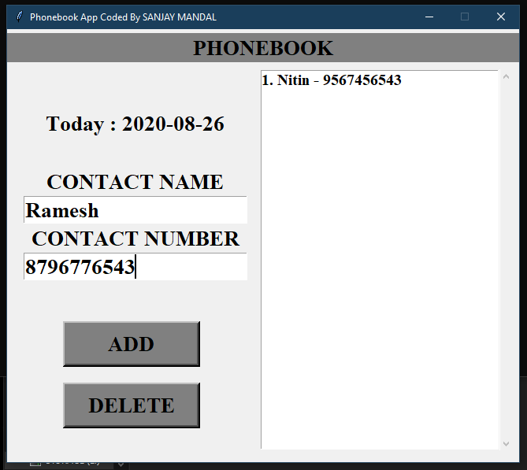
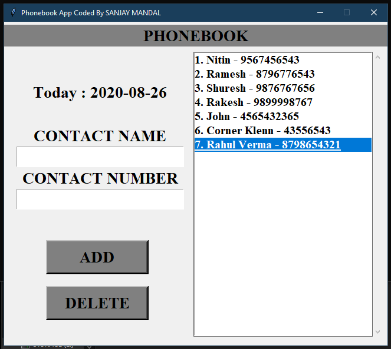
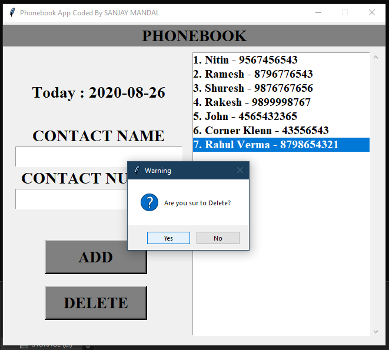
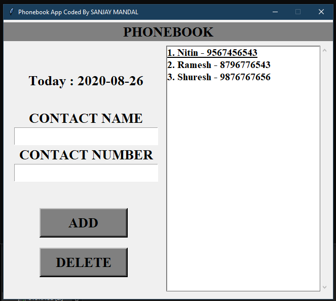

# Phonebook-app-PYTHON
I tryna make lite, simple, single window operational and single threaded auto update single file phonebook app with self creating db file in PYTHON

output screenshots

adding new contacts

deleting contact

